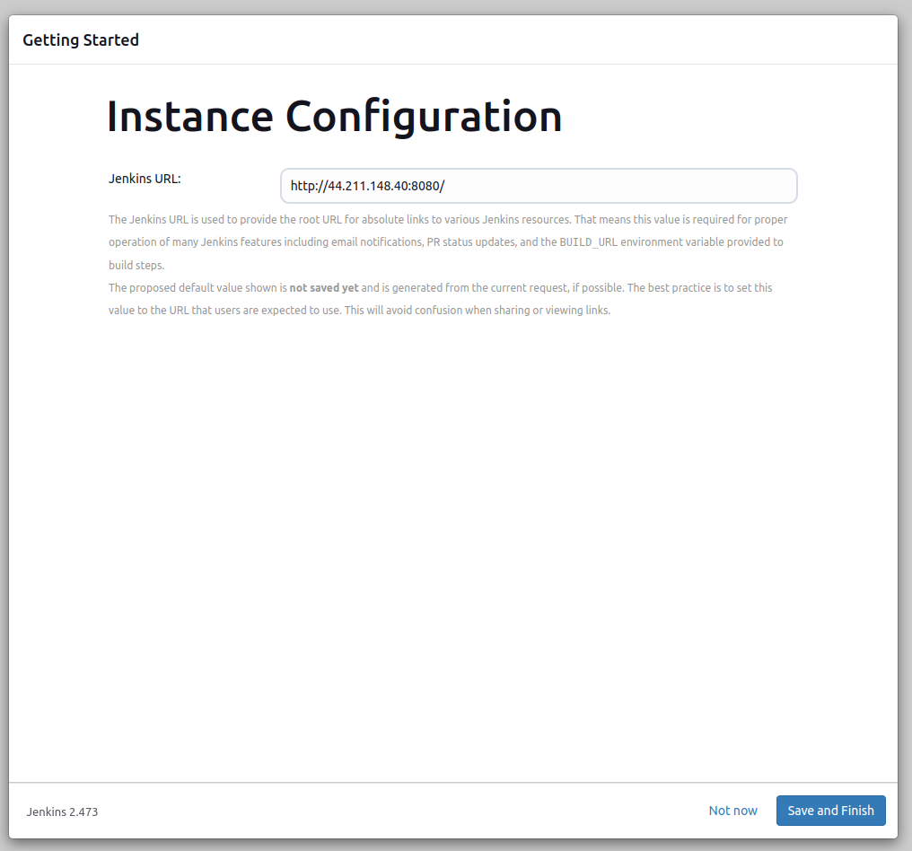

# Setting up the CI/CD Pipeline with Jenkins

- EC2
- Docker
- Jenkins
- GitHub
- Django

## Create a Repository

1. In the upper-right corner of any page, select ➕, then click New repository.

2. Type a short, memorable name for your repository. For example, "hello-world".
3. Select Add README file
4. Under `Add .gitignore` select the template for your desired environment. For example "Python"
5. Select Create repository 
   
   

## Initial Project setup

1. Clone repo to Local environment:

    ```shell
    git clone <link to repository>
    ```

2. Create and activate virtual environment:

    ```shell
    # Linux
    # Create virtual environment
    python3 -m venv .venv --prompt web-app

    # Activate virtual environment
    source .venv/bin/activate
    ```

    ```shell
    # Windows/Powershell
    python -m venv .venv

    .venv\Scripts\activate
    ```

3. Install Django

    ```shell
    pip install Django
    ```

4. Create requirements file:

    ```shell
    pip freeze > requirements.txt
    ```

5. Create a django project:

    ```shell
    django-admin startproject config .
    ```

- Your folder structure should now look similar to this:

    

## EC2 Environment setup

1. Login to your AWS console and navigate to the EC2 service
2. Select "Launch instance"
3. Give your instance a name, for example "Web App Server"
4. Select Ubuntu under "Application and OS Images"
    
5. Create a new key pair and save it on your local machine

6. Under "Network settings" ensure that you have selected:
    - "Create security group"
      1. [x] Allow SSH traffic
      
      2. [x] Allow HTTPS traffic from the internet
      
      3. [x] Allow HTTP traffic from the internet
    
    
    
    > Alternatively you could use a security group that has these rules set already.

7. Configure suitable storage for your desired project.
8. Launch the instance

**Configure inbound security rules**

9. Once the instance is launched navigate to the security group for your newly created EC2 instance
10. Edit the inbound rules to allow traffic through port 8000 (for Django) and port 8080 (for Jenkins)
    
    


## Install Jenkins on EC2

1. Connect to your EC2 instance and run the following commands to install Jenkins:
    ```shell
    sudo apt update

    sudo apt install fontconfig openjdk-21-jre

    sudo wget -O /usr/share/keyrings/jenkins-keyring.asc https://pkg.jenkins.io/debian/jenkins.io-2023.key

    echo deb [signed-by=/usr/share/keyrings/jenkins-keyring.asc] https://pkg.jenkins.io/debian binary/ | sudo tee /etc/apt/sources.list.d/jenkins.list > /dev/null

    sudo apt-get update

    sudo apt-get install jenkins

    sudo systemctl enable jenkins

    sudo systemctl start jenkins

    sudo systemctl status jenkins
    ```

    **Configure the Jenkins Server**

2. Navigate to `http://<your-ec2-public-ip-address>:8080`

    

3. Run `sudo cat /var/lib/jenkins/secrets/initialAdminPassword` to get the admin password and use it to Unlock Jenkins

    

4. Select "Install suggested plugins":
    
    

5. Follow the prompts to create a new admin user
    
    

6. Confirm that the `Jenkins URL` matches the URL in your browser tab
    
    

7. Click on Start using Jenkins to be redirected to the Dashboard

## Install Docker on EC2

1. Connect to your EC2 instance and run the following commands to install Jenkins:

    ```shell

    # Add Docker's official GPG key:
    sudo apt-get update
    sudo apt-get install ca-certificates curl
    sudo install -m 0755 -d /etc/apt/keyrings
    sudo curl -fsSL https://download.docker.com/linux/ubuntu/gpg -o /etc/apt/keyrings/docker.asc
    sudo chmod a+r /etc/apt/keyrings/docker.asc

    # Add the repository to Apt sources:
    echo "deb [arch=$(dpkg --print-architecture) signed-by=/etc/apt/keyrings/docker.asc] https://download.docker.com/linux/ubuntu $(. /etc/os-release && echo "$VERSION_CODENAME") stable" | sudo tee /etc/apt/sources.list.d/docker.list > /dev/null
    sudo apt-get update 

    # Install docker
    sudo apt-get install docker.io

    # Install docker packages
    sudo apt-get install docker-ce docker-ce-cli containerd.io docker-buildx-plugin docker-compose-plugin
    
    # Enable docker service
    sudo systemctl enable docker
    
    # Start the docker service
    sudo systemctl start docker

    # Check if the service is running
    sudo systemctl status docker

    # add docker user to the same user group as root user
    sudo usermod -aG docker $USER

    # Create username and password for DockerHub
    docker login -u <username>

    # Give permissions for docker socket file
    sudo chmod 666 /var/run/docker.sock
    sudo usermod -aG docker $USER
    ```
   
## Repo setup for Docker

1. In the `config/settings.py` file on your local repo edit the `ALLOWED_HOSTS` setting to add the IP address for your EC2 instance.

2. Create a file named `Dockerfile` at the root of your local repository

3. Add the following code to it:

    ```
    # Use Python 3.11 as the base image
    FROM python:3.11

    # Set the working directory within the container
    WORKDIR /app/test-app

    # Copy the requirements.txt file to the container
    COPY requirements.txt /app/test-app

    # Install dependencies using pip
    RUN pip install -r requirements.txt

    # Copy the application to the container
    COPY . /app/test-app

    # Expose port 8000
    EXPOSE 8000

    # Apply migrations to set up the database (SQLite)
    RUN python manage.py migrate

    # Run the Django application
    CMD ["python", "/app/test-app/manage.py", "runserver", "0.0.0.0:8000"]
    ```
    > Read more about Dockerfiles here [https://docs.docker.com/reference/dockerfile/](https://docs.docker.com/reference/dockerfile/)

4. Push changes to remote repo

    ```shell
    git add .
   
    git commit -m "<Your commit message>"
   
    git push
    ```

## Test Docker on EC2

On your EC2 instance

1. Clone the app repository to EC2

    ```shell
    git clone <link to your repo>
    ```

2. Navigate into the app directory

3. Build a docker container

    ```shell
    docker build -t <desired tag name> .
    ```

4. Run the created Docker container

    ```shell
    docker run -d -p 8000:8000 test-app:latest
    
    docker ps
    ```
   
5. In your EC2 instnce add docker user to the jenkins group
        
    ```shell
    sudo usermod -aG docker jenkins
    ```
   
6. In the browser navigate to `http://<your EC2 IP address:8000` to confirm the container ran successfully.

## Create Docker Hub Personal Access Token

1. Sign in to your Docker account [https://login.docker.com/u/login/](https://login.docker.com/u/login/)

2. Select your avatar in the top-right corner and from the drop-down menu select Account settings.

3. In the Security section, select Personal access tokens.

4. Select Generate new token.

5. Add a description for your token. Use something that indicates the use case or purpose of the token.

6. Set the access permissions. The access permissions are scopes that set restrictions in your repositories. For example, for Read & Write permissions, an automation pipeline can build an image and then push it to a repository. However, it can't delete the repository.

7. Select Generate and then copy the token that appears on the screen and save it. You won't be able to retrieve the token once you close this prompt.

## Configure Jenkins Credentials for Docker   

In the Jenkins dashboard:

1. Select "Manage Jenkins"
2. Under the Security section select "Credentials"
3. Click on the "System" credentials
4. Click on "Global credentials (unrestricted)"
5. Click "Add credentials":
    - Kind: Username with password
    - Enter the username for your Docker account
    - For password enter the Personal Access Token you created earlier
    - Enter ID as "dockerHub"
    
    

## Configure Jenkins Job

In the Jenkins dashboard:

1. Click on "Create a job"
    - Give the job a name
    - Select the "Pipeline" item type
    - Click "OK"

   

2. Configure General Settings:
   - Choose Discard old builds   
   - Select github project and enter the repository URL
   
   
   - Under build triggers:
     - select "GitHub hook trigger for GITScm polling"
     
     
   - Under pipeline:
   
       - Select "Pipeline script from SCM" for definition
       - Select Git as the SCM
       - Add the repository URL
     
                

       - Ensure Branch specifier has the correct default branch
       - Input Jenkinsfile as the Script path
        

## Create GitHub webhook

1. Navigate to the repository settings
2. Select "Webhooks"
3. Select "Add Webhook"
4. Enter payload URL `http://<your EC2 ip address>:8080/github-webhook/`
5. Under content type select `application/x-www-form-urlencoded`
6. Select "Send me everything"
7. Ensure that "Active" is selected

    

8. Click on "Add Webhook"

## Create Build Configuration Files

1. At the root of your local repository create 2 files:

   1. `Jenkinsfile`
   2. `docker-compose.yml`
   
2. In the `Jenkinsfile` add the following code:

    ```
    pipeline {
        agent any
    
        stages {
            stage("Clone Code") {
                steps {
                    echo "Cloning the code"
                    git url: "<your GitHub URL>", branch: "main"
                }
            }
    
            stage("Build") {
                steps {
                    echo "Building the Docker image"
                    sh "sudo docker build -t test-app ."
                }
            }
    
            stage("Push to Docker Hub") {
                steps {
                    echo "Pushing image to Docker Hub"
                    withCredentials([usernamePassword(credentialsId: "dockerHub", passwordVariable: "dockerHubPass", usernameVariable: "dockerHubUser")]) {
                        sh "sudo docker tag test-app ${env.dockerHubUser}/test-app:latest"
                        sh "sudo docker login -u ${env.dockerHubUser} -p ${env.dockerHubPass}"
                        sh "sudo docker push ${env.dockerHubUser}/test-app:latest"
                    }
                }
            }
    
            stage ("Deploy") {
                steps {
                    echo "Deploying the container"
                    sh "sudo docker compose down && docker compose up -d"
                }
            }
        }
    }
    ```
   > Read more about Jenkinsfile Syntax here [https://www.jenkins.io/doc/book/pipeline/syntax/](https://www.jenkins.io/doc/book/pipeline/syntax/)

3. In the `docker-compose.yml` add the following code:

    ```yaml
    version: "3.3"
    services:
      web: 
        image: <your docker username>/test-app:latest
        ports:
          - "8000:8000" 
    ```
    
    > Read more about YAML syntax here [https://spacelift.io/blog/yaml](https://spacelift.io/blog/yaml)
    
    > Read more about Docker Compose here [https://docs.docker.com/compose/](https://docs.docker.com/compose/)

## Test the CI/CD Pipeline

1. Push the updated code to the remote repository
2. In the Jenkins dashboard check the progress of the build

    


### Extra Resources
- [https://www.jenkins.io/doc/](https://www.jenkins.io/doc/)
- [https://docs.docker.com/](https://docs.docker.com/)
- 